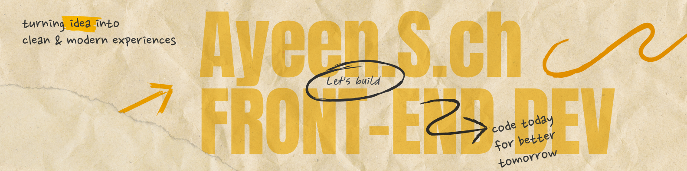

<h1 align="center">

</h1>

<h3 align="center">Frontend Developer • UI/UX Designer • Computer Engineering Student </h3>
<h3 align="center">Passionate about building beautiful, fast and user-centered web experiences.</h3>

---

## 🚀 About Me

- 🎓 Computer Engineering Student
- 💻 Learning React & TypeScript
- 🎨 Passionate about UI/UX & Product Design
- 🌱 Currently improving Frontend Architecture
- 📍 Iran

---

## 🛠 Tech Stack

---

## 🔥 Current Goals

- Build SaaS Products
- Learn React & Typescript
- Improve UI Animation
- Learning UX Researcher

---

## 🚀 Featured Projects
<ul>
  <li>
    🌐
    <a href="https://ayeensadeghi.github.io/responsive-landing-page-v1/">
      Responsive Landing Page v1
    </a>
    •
    <a href="https://github.com/Ayeensadeghi/responsive-landing-page-v1">
      Source Code
    </a>
  </li>

  <li>🌦️ Weather App <i>(Coming Soon)</i></li>
  <li>🎬 Movie App <i>(Coming Soon)</i></li>
  <li>✅ Todo App <i>(Coming Soon)</i></li>
</ul>

---

## 🌐 Connect With Me

  <a href="https://www.linkedin.com/in/ayeensch85/" > 
     
   
   
   

---

